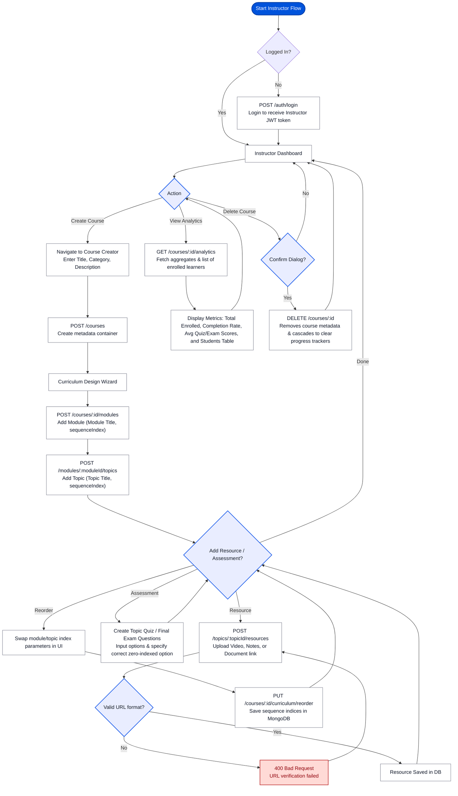
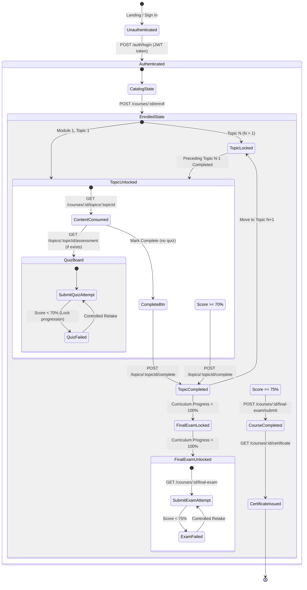

# LMS User Flow Diagram

This document outlines the user flows for both **Learners** and **Instructors/Administrators**, detailing user states, transitions, validations, and API endpoint bindings based on the PRD, KPI, and API design specifications.

---

## 1. Learner Flow

The following Mermaid diagram traces the Learner's journey from onboarding and course enrollment to sequential topic completion, assessments, final exam evaluation, and PDF certificate issuance.

```mermaid
graph TD
    %% Styling Definitions
    classDef startEnd fill:#0053db,stroke:#003ea8,stroke-width:2px,color:#fff;
    classDef process fill:#ffffff,stroke:#737686,stroke-width:1px,color:#141b2b;
    classDef decision fill:#e9edff,stroke:#2563eb,stroke-width:2px,color:#141b2b;
    classDef error fill:#ffdad6,stroke:#ba1a1a,stroke-width:1.5px,color:#93000a;

    Start([Start Learner Flow]) --> RegState{Has Account?}
    class Start startEnd;

    %% Onboarding & Authentication
    RegState -- No --> Register["POST /auth/register<br/>Register with Name, Email, Password, Role"]
    class Register process;
    Register --> Login["POST /auth/login<br/>Login to receive JWT token"]
    class Login process;
    RegState -- Yes --> Login
    
    Login --> Profile["GET /auth/profile<br/>Access / edit profile name/email"]
    class Profile process;
    
    %% Course Discovery & Enrollment
    Profile --> Catalog["GET /courses<br/>Browse Course Catalog"]
    class Catalog process;
    
    Catalog --> SelectCourse{Select Course}
    class SelectCourse decision;
    
    SelectCourse --> CheckEnrollment{Already Enrolled?}
    class CheckEnrollment decision;
    
    CheckEnrollment -- Yes --> CoursePlayer["GET /courses/:id<br/>Load Course Hierarchy"]
    class CoursePlayer process;
    CheckEnrollment -- No --> Enroll["POST /courses/:id/enroll<br/>Create progress tracker (0%)"]
    class Enroll process;
    Enroll --> CoursePlayer

    %% Sequential Learning Loop
    CoursePlayer --> SelectTopic{Select Topic N}
    class SelectTopic decision;
    
    SelectTopic --> LockCheck{Is preceding Topic N-1 complete?}
    class LockCheck decision;
    
    LockCheck -- No --> LockedError["403 Forbidden<br/>Topic is locked block screen"]
    class LockedError error;
    LockedError --> SelectTopic
    
    LockCheck -- Yes (or N=1) --> LoadTopic["GET /courses/:id/topics/:topicId<br/>Access topic resources (Video, Notes, PDFs)"]
    class LoadTopic process;
    
    LoadTopic --> AssessCheck{Has Assessment Quiz?}
    class AssessCheck decision;
    
    %% Topic Assessment Verification
    AssessCheck -- Yes --> LoadQuiz["GET /topics/:topicId/assessment<br/>Retrieve quiz questions (answers excluded)"]
    class LoadQuiz process;
    LoadQuiz --> SubmitQuiz["POST /topics/:topicId/assessment/submit<br/>Submit quiz answers for grading"]
    class SubmitQuiz process;
    SubmitQuiz --> GradeQuiz{Score >= 70% Passing Threshold?}
    class GradeQuiz decision;
    
    GradeQuiz -- No --> FailQuiz["Save attempt in MongoDB<br/>Retake allowed, progress locked"]
    class FailQuiz error;
    FailQuiz --> LoadQuiz
    
    GradeQuiz -- Yes --> MarkComplete["POST /topics/:topicId/complete<br/>Mark topic complete, recalculate overall progress"]
    class MarkComplete process;
    
    AssessCheck -- No --> MarkBtn["Click 'Mark as Completed'<br/>POST /topics/:topicId/complete"]
    class MarkBtn process;
    MarkBtn --> MarkComplete
    
    %% Progression Loop Check
    MarkComplete --> ProgressCheck{All Topics complete (Progress = 100%)}
    class ProgressCheck decision;
    
    ProgressCheck -- No --> UnlocksNext[Topic N+1 unlocked]
    class UnlocksNext process;
    UnlocksNext --> SelectTopic
    
    %% Final Examination & Certificate Claim
    ProgressCheck -- Yes --> UnlockExam[Final Exam Unlocked]
    class UnlockExam process;
    
    UnlockExam --> LoadExam["GET /courses/:id/final-exam<br/>Retrieve final exam questions"]
    class LoadExam process;
    
    LoadExam --> SubmitExam["POST /courses/:id/final-exam/submit<br/>Submit final exam for evaluation"]
    class SubmitExam process;
    
    SubmitExam --> GradeExam{Score >= 75% Passing Threshold?}
    class GradeExam decision;
    
    GradeExam -- No --> FailExam["Save attempt<br/>Retake allowed, certificate locked"]
    class FailExam error;
    FailExam --> LoadExam
    
    GradeExam -- Yes --> CertEligible["Course Completed<br/>Certificate eligibility = true"]
    class CertEligible process;
    
    CertEligible --> GetCert["GET /courses/:id/certificate<br/>Compile & stream dynamically generated PDF"]
    class GetCert process;
    
    GetCert --> End([End Learner Flow])
    class End startEnd;
```

---

## 2. Instructor / Administrator Flow

The following Mermaid diagram traces the Instructor's journey from creating a course to designing modules and topics, uploading content resources, structuring assessments, reordering, and reviewing course performance metrics.



---

## 3. Core API Endpoint State Diagram

This state transition diagram illustrates how key API endpoints transition user learning and curation states between **Locked**, **Unlocked**, **Completed**, and **Certified**.


