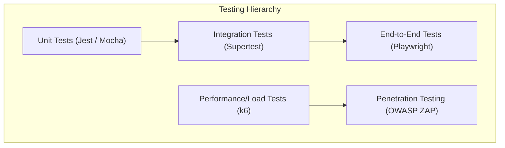

# Project Completion Criteria & KPI Document (KPI.md)
## Project: Secure Online Examination Platform (SecureExam)
## Document Version: 1.0.0
## Date: 2026-06-05

---

## 1. Feature Acceptance Criteria (AC)

This section maps out the explicit acceptance criteria required to sign off on the implementation of core features described in the PRD.

### EPIC-01: Candidate Identity Verification and System Readiness

| AC ID | Feature Ref | Scenario | Expected Behavior |
| :--- | :--- | :--- | :--- |
| **AC-101** | FR-101 (Selfie) | Webcam selfie capture | **Given** the candidate is at the identity setup page, **when** they click "Capture", **then** the webcam captures a still frame, verifies face presence, and extracts face vector coordinates within 1.5 seconds. |
| **AC-102** | FR-102 (ID Scan) | ID upload and text match | **Given** a government ID image upload, **when** the system parses the image, **then** OCR extracts the text, confirms the document structure, and verifies that the name matches registration records. |
| **AC-103** | FR-103 (Compare) | Biometric match validation | **Given** a captured selfie and an ID photo, **when** the biometric matcher calculates a similarity vector, **then** it allows exam progression *only if* the match confidence is $\ge 85\%$ ($BRL-001$). Otherwise, it halts access and prompts proctor approval. |
| **AC-104** | FR-104 (Syscheck) | Pre-flight check failure | **Given** a candidate starts the pre-flight check, **when** webcam access is denied or internet upload speed is $<1.0\text{ Mbps}$, **then** the system displays a clear diagnostic warning and blocks the "Start Exam" button. |

### EPIC-02: Lockdown Exam Environment

| AC ID | Feature Ref | Scenario | Expected Behavior |
| :--- | :--- | :--- | :--- |
| **AC-201** | FR-201 (Fullscreen) | Exit fullscreen action | **Given** an active lockdown exam session, **when** the user exits fullscreen mode, **then** the exam timer pauses, the screen is covered with a warning modal, an anomaly is logged, and a 20-second countdown to resume fullscreen begins. |
| **AC-202** | FR-202 (Events) | Prevent paste key combination | **Given** a candidate attempts to copy/paste using `Ctrl+V` / `Cmd+V` or right-click context menu, **when** the keyboard/mouse event triggers, **then** the browser intercepts the event, cancels the default action, and shows a tooltip explaining copy/paste is blocked. |
| **AC-203** | FR-203 (Blur) | Browser focus loss | **Given** an exam is in progress, **when** the candidate clicks on a desktop notification or attempts to switch applications (blur event), **then** the exam logs a `FOCUS_LOST` anomaly and locks the exam screen. |
| **AC-204** | FR-204 (Displays) | Secondary monitor connect | **Given** the exam starts, **when** the system detects display count $> 1$, **then** the system displays "Multiple Monitors Detected" error screen and prevents exam loading until secondary monitor is disconnected. |

### EPIC-03: AI-Assisted Proctoring Engine

| AC ID | Feature Ref | Scenario | Expected Behavior |
| :--- | :--- | :--- | :--- |
| **AC-301** | FR-301 (Visual) | Candidate leaves webcam frame | **Given** webcam feed is streaming, **when** the candidate's face is absent from the frame for $>5$ seconds, **then** the system fires a local websocket notification and logs a `FACE_ABSENT` anomaly with an image URL. |
| **AC-302** | FR-302 (Audio) | Voice detected in room | **Given** the microphone stream, **when** speech-to-text detects conversational words with confidence $> 80\%$, **then** the engine logs an `AUDIO_VOICE_DETECTED` anomaly and transcribes the speech. |
| **AC-303** | FR-303 (Dashboard)| Live streaming to dashboard | **Given** the Proctor opens the live room, **when** candidate sessions are active, **then** WebRTC streams candidate video, audio, and active screen share onto a grid dashboard, updating flags in real-time. |

### EPIC-05: Resilient Exam Delivery & Workspace

| AC ID | Feature Ref | Scenario | Expected Behavior |
| :--- | :--- | :--- | :--- |
| **AC-501** | FR-502 (Autosave) | Network connection loss | **Given** a candidate is answering a question, **when** the network interface drops offline, **then** the workspace displays a yellow banner, saves data to IndexedDB, and queues synchronization. |
| **AC-502** | FR-502 (Sync) | Recovery of network | **Given** network drops and reconnects, **when** internet service is restored, **then** the sync engine flushes cached database changes to the cloud API in order, updating the status banner to green. |
| **AC-503** | FR-503 (Hard close) | Session time expiration | **Given** the exam timer reaches `00:00:00`, **when** the tick occurs, **then** the system triggers $BRL-002$, pushes all saved answers, blocks candidate editing, and loads the exam submission success page. |

### EPIC-06: Grading and Moderation Pipeline

| AC ID | Feature Ref | Scenario | Expected Behavior |
| :--- | :--- | :--- | :--- |
| **AC-601** | FR-602 (Double) | Blind essay review | **Given** Grader A views submission 101, **when** they grade the essay, **then** the system displays no candidate identifier (blind) and hides any score input by Grader B (double-blind). |
| **AC-602** | FR-603 (Escalate) | Score difference discrepancy | **Given** Grader A awards 90% and Grader B awards 70% ($>15\%$ gap), **when** scores are finalized, **then** the status changes to "Disputed" and the exam routes to the Senior Moderator queue. |

### EPIC-07: Verifiable Certification & Results

| AC ID | Feature Ref | Scenario | Expected Behavior |
| :--- | :--- | :--- | :--- |
| **AC-701** | FR-701 (Generate) | Certificate signing | **Given** an exam is fully graded, **when** the final score is $\ge$ pass mark, **then** the cert service builds a PDF, signs metadata with the server's private key, and stores it in secure S3. |
| **AC-702** | FR-702 (Verify) | QR code scan validation | **Given** an employer scans the certificate's QR code, **when** the public portal is reached, **then** the page performs signature checks and displays "Certificate Authentic" with correct details. |

---

## 2. Functional Requirements Checklist

Use this checklist to sign off on specific functional components prior to staging deployment:

- [ ] **FRC-001 (Biometrics):** Face embedding extractor yields stable hashes; vectors compared on Euclidean distance metrics $\le 1.2$ seconds.
- [ ] **FRC-002 (System Checks):** Checks correctly evaluate and report camera access, mic gain levels, screen resolution, and bandwidth latency.
- [ ] **FRC-003 (Browser Lock):** Fullscreen exit, application blur, and shortcut key events are reliably caught across Chrome, Edge, Safari, and Firefox.
- [ ] **FRC-004 (Screen Capture):** Multi-display checks correctly raise errors when a candidate hooks up an external monitor.
- [ ] **FRC-005 (Video Proctoring):** AI engine accurately labels face count (0, 1, 2+) and tracks eye-gaze deviations $> 35$ degrees left/right.
- [ ] **FRC-006 (Audio Proctoring):** Audio engine filters constant keyboard click decibels and captures spoken sentences cleanly.
- [ ] **FRC-007 (Proctor Panel):** Proctor dashboard renders WebRTC videos and triggers red visual alerts within 1 second of API anomaly receipt.
- [ ] **FRC-008 (Authoring Portal):** Examiners can create tags, write mathematical equations using LaTeX syntax, and upload images.
- [ ] **FRC-009 (Question Banking):** Dynamic randomization accurately pulls specific question counts from targeted categories per user exam.
- [ ] **FRC-010 (Workspace UI):** Workspace interface adjusts dynamically to fit candidate screen dimensions without overlap or text truncation.
- [ ] **FRC-011 (Autosave Engine):** Data is logged in local client IndexedDB and matches database state on final server submission.
- [ ] **FRC-012 (Offline Sync):** System recovers cleanly from network failure durations up to 45 minutes without data corruption or loss.
- [ ] **FRC-013 (Auto-Grading):** True/False, MCQ, and multiple choice questions compute scores automatically with zero rounding errors.
- [ ] **FRC-014 (Double-Blind Grading):** Independent graders remain isolated; system automatically flags grader score gaps $>15\%$ of total points.
- [ ] **FRC-015 (Cert Verification):** Cryptographic signatures on certificates can be validated via public verification REST API endpoints.

---

## 3. UI Checklist (UI Quality & Design)

The system must present a premium, distraction-free aesthetic matching modern web app design.

- [ ] **UIC-001 (Color Harmony):** Use HSL-tailored colors with clean dark/light mode switches. Base colors must maintain a minimum 4.5:1 contrast ratio (WCAG 2.1 AA compliance).
- [ ] **UIC-002 (Aesthetic Cleanliness):** Candidate workspace must be distraction-free. No sidebars, navigation bars, footer links, or external headers during the exam lockdown state.
- [ ] **UIC-003 (Micro-Animations):** Soft, smooth transitions (0.2s duration) on button hovers, page switches, and alert expansions.
- [ ] **UIC-004 (Timer Alert UI):** Timer changes color from blue to orange (at $< 10$ minutes remaining) and flashing red (at $< 2$ minutes remaining).
- [ ] **UIC-005 (Network Status Banner):** Offline indicator must show a subtle, non-blocking floating status banner (Yellow: "Offline mode - saving locally"; Green: "Synced with server").
- [ ] **UIC-006 (Proctor Grid UI):** Proctor dashboard displays candidate video cells in a responsive CSS grid, supporting custom grid layouts (e.g., 2x2, 3x3, 4x4 views).
- [ ] **UIC-007 (Accessibility Focus):** Visible keyboard focus rings (outline indicators) for all candidates navigating interactive buttons via Tab key.
- [ ] **UIC-008 (Responsive Tables):** Question databases and grading dashboards in the examiner portal must wrap and fit on smaller screens without horizontal scroll scrollbars on tables.
- [ ] **UIC-009 (Verifiable Page Cleanliness):** Public verification screen must present clear trust indicators (padlock icons, verified checkmarks) and responsive layout for mobile scans.
- [ ] **UIC-010 (System Check Diagnostics):** System checks display simple success indicators (green checks) or error solutions (e.g., "How to enable webcam in Chrome").

---

## 4. Security Checklist

- [ ] **SECC-001 (Biometric Protection):** Verify that zero raw candidate photos are saved to long-term SQL storage. Biometric vectors must be stored in encrypted database columns.
- [ ] **SECC-002 (Video Storage Access):** S3 proctoring snapshots/videos must not be public. Access is restricted using secure AWS IAM roles and time-limited, signed URLs (SAS tokens expiring in $\le 10$ minutes).
- [ ] **SECC-003 (Token Security):** Validate JWT validation logic. Verify that auth tokens expire in 15 minutes and refresh tokens utilize HttpOnly cookies.
- [ ] **SECC-004 (Input Sanitization):** Run automated checks confirming that math, essay, and text boxes are fully sanitized to prevent Cross-Site Scripting (XSS) and SQL injection.
- [ ] **SECC-005 (Lockdown Bypassing):** Test and confirm that virtual machines (e.g., VirtualBox, VMware) or remote assistance apps (e.g., TeamViewer, AnyDesk) are successfully detected and blocked.
- [ ] **SECC-006 (HMAC Sync Security):** Verify that each client-to-server answer sync payload is hashed with an HMAC validation key to prevent message tampering.
- [ ] **SECC-007 (Global Session Kill):** Confirm that hitting the administrator "Invalidate User Session" API terminates live WebSockets and forces candidate logout within 2 seconds.
- [ ] **SECC-008 (Cryptographic Signature):** Verify certificate generation signatures are calculated using SHA-256 with RSA-2048 keys managed by AWS Secrets Manager or KMS.

---

## 5. Performance Checklist

- [ ] **PERFC-001 (API Latency):** Static resource loads $\le 1.5$ seconds under normal cache conditions. Core transaction API routes (e.g., sync response) $\le 200\text{ms}$.
- [ ] **PERFC-002 (Websocket Latency):** Websocket events propagate between Candidate client, server, and Proctor dashboard in $\le 500\text{ms}$.
- [ ] **PERFC-003 (Biometric Matching Speed):** Server facial verification matches vector embeddings against database records in $\le 1.2$ seconds under test database loads of 100k items.
- [ ] **PERFC-004 (Video Compression):** Client compression script limits webcam streaming frames to 10fps at 360p resolution, consuming $\le 200\text{ Kbps}$ upload bandwidth.
- [ ] **PERFC-005 (Autosave Throttle):** Autosave operations throttle requests to once every 10 seconds (or on blur events) to prevent API Gateway overload.
- [ ] **PERFC-006 (Concurrency load):** Load tests verify the server handles 25,000 concurrent active users submitting answers, maintaining a 99.95% API success rate.
- [ ] **PERFC-007 (Local Cache Memory Limit):** IndexedDB storage footprints must not exceed $20\text{ MB}$ per candidate exam session.
- [ ] **PERFC-008 (Database Read Scaling):** Queries on active exam lists, proctor timelines, and question banks must utilize indexing, responding in $\le 100\text{ms}$.

---

## 6. Testing Requirements

### 6.1 Automated Test Suites
* **TSTR-001 (Unit Tests):** All math parsing functions, grading calculation engines, signature signing functions, and date calculations must have unit tests. Code coverage target: $\ge 85\%$.
* **TSTR-002 (Integration Tests):** API endpoints tested for payload structure, parameter validation, error returns, and database persistence.
* **TSTR-003 (IndexedDB Local Resiliency Tests):** Simulated client crash scripts must confirm that data remains fully intact in IndexedDB after browser restart.
* **TSTR-004 (Simulated WebRTC Load Tests):** Run scripts simulating WebRTC signaling load to confirm socket connection limits at peak scaling (e.g., using `k6` or `Artillery`).

### 6.2 Manual Testing Loops
* **TSTR-005 (Cross-Device UAT):** Conduct manual verification on MacOS, Windows, Chromebooks, and iPadOS devices across Chrome, Safari, and Firefox.
* **TSTR-006 (Proctoring False-Positive Review):** Conduct simulated examinations with 50 live candidates. Examiners review logged flags to fine-tune AI noise-threshold values.

---

## 7. Launch Readiness Checklist

- [ ] **LRC-001 (Production Infrastructure):** Deploy production databases with multi-AZ replication, load balancers, and Auto Scaling groups.
- [ ] **LRC-002 (Secrets Rotation):** Replace all development secrets, database credentials, and certificates with production keys managed inside AWS Secrets Manager.
- [ ] **LRC-003 (Disaster Recovery Plan):** Set up automated daily snapshots for database storage and test the recovery process. Target RTO (Recovery Time Objective): $\le 1$ hour; RPO (Recovery Point Objective): $\le 10$ minutes.
- [ ] **LRC-004 (Third-Party Audits):** Complete external vulnerability assessments, address any high/medium security concerns.
- [ ] **LRC-005 (Privacy & Consent):** Put user consent forms regarding camera access, voice recording, and biometric template extraction into the sign-up flow.
- [ ] **LRC-006 (Support Playbook):** Establish technical customer support workflows, including support templates for browser compatibility issues.
- [ ] **LRC-007 (Status Page):** Configure public platform status reporting (e.g., Statuspage.io) reflecting API, database, and proctoring server health.
- [ ] **LRC-008 (Analytics Dashboard):** Set up production analytics logs and error alerting dashboards (e.g., Datadog, Sentry).

---

## 8. Definition of Done (DoD)

A user story or feature is only considered "Done" and ready for inclusion in a release when the following criteria are met:

1. **Code Quality & Review:**
   * Code compiles with zero warnings or errors.
   * Pull Request (PR) is created, undergoes peer review by at least one Senior Engineer, and gets approved.
   * Code adheres to codebase styling patterns and maintains documentation comment blocks.
2. **Testing Validation:**
   * Unit test coverage meets or exceeds the target threshold ($85\%$).
   * Integration tests verify correct DB record handling and API contract behavior.
   * Local network failure simulations run successfully with zero exam data loss.
3. **Security Standards:**
   * Input text fields are fully sanitized.
   * APIs require valid JWT headers and evaluate user scopes (RBAC).
   * Biometric vector comparison models comply with GDPR privacy rules.
4. **UI/UX & Accessibility:**
   * Design is fully responsive, looking clean on desktop, tablet, and mobile screens.
   * Accessibility tags (ARIA attributes) are present, and keyboard tab-navigation functions correctly.
5. **Deployment & Verification:**
   * Code is successfully deployed to a staging or UAT sandbox environment.
   * Manual regression tests show zero issues.
   * Walkthrough is documented, showing system logs and screenshots of successful operation.
