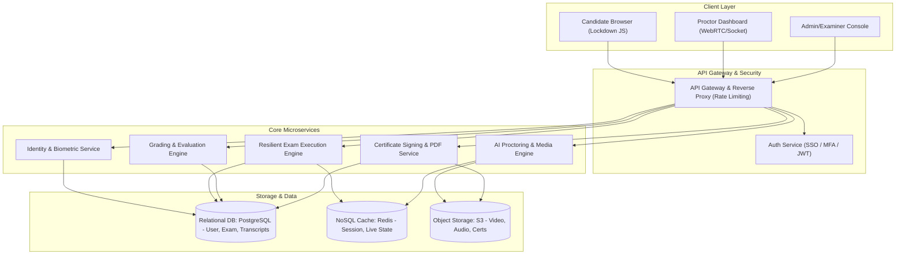
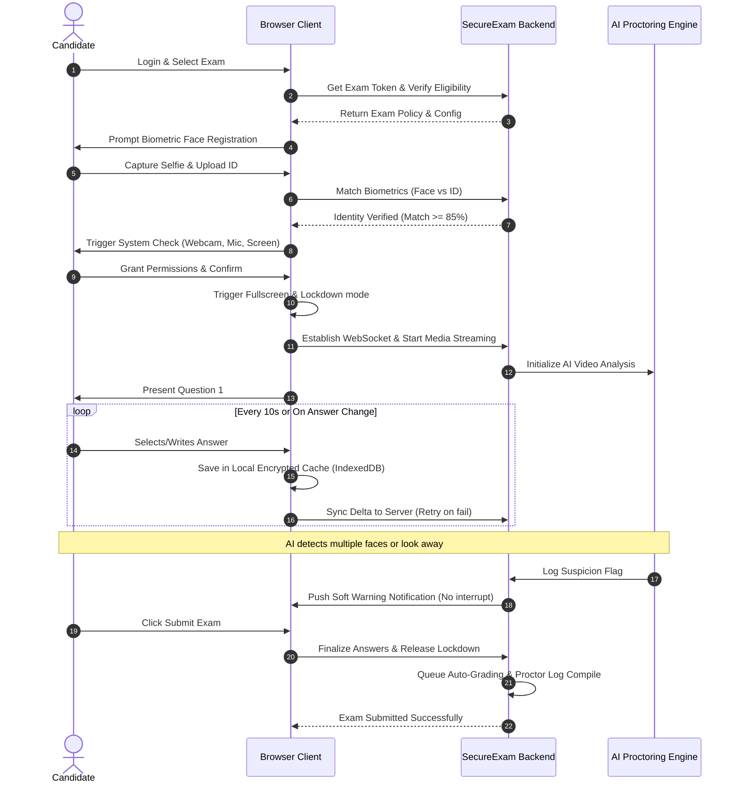
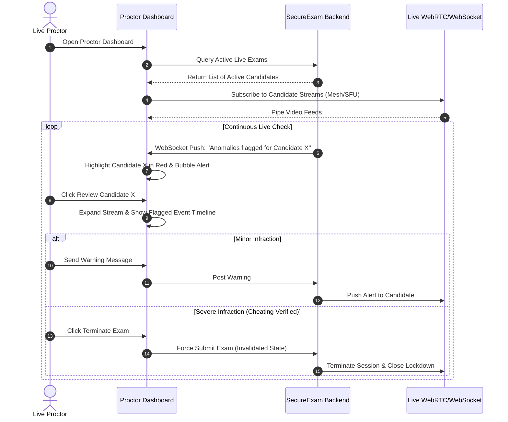
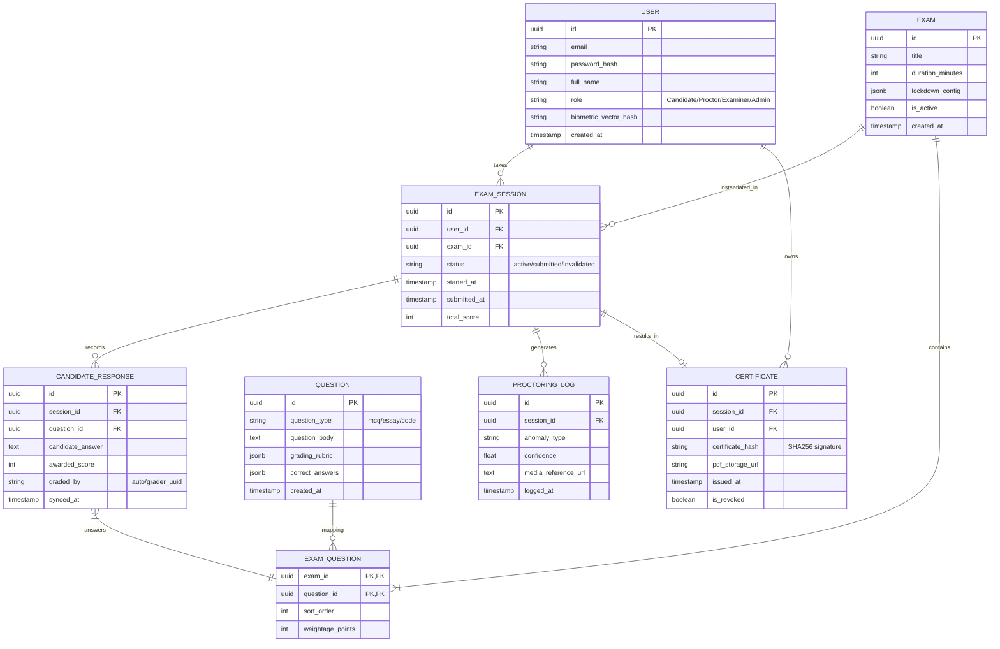

# Product Requirements Document (PRD)
## Project: Secure Online Examination Platform (SecureExam)
## Document Version: 1.0.0
## Date: 2026-06-05

---

## 1. Product Overview

SecureExam is a web-based, end-to-end secure examination system that allows organizations to author high-stakes exams, verify candidate identities, execute exams in a lockdown browser environment, monitor candidates via real-time AI and human proctoring, grade submissions through automated and manual workflows, and issue verifiable digital certificates. 

The system is designed with a mobile-responsive candidate workspace (though optimized for desktop) and features client-side resiliency to ensure that intermittent network drops do not impact exam progress.

---

## 2. User Roles

The system supports four primary user roles:
1. **Candidate (Test Taker):** Authenticates, registers biometrics, runs system checks, answers questions under secure lockdown conditions, reviews progress, and downloads certificates.
2. **Proctor (Invigilator):** Monitors candidate video/audio streams, views AI-generated suspicion flags, reviews recorded sessions, sends warning messages, and submits exams on behalf of compromised candidates.
3. **Examiner (Author & Grader):** Authors questions, creates exams, sets up grading rubrics, performs blind manual grading of descriptive questions, and signs off on final results.
4. **System Administrator:** Manages organization-wide settings, user roles (RBAC), security credentials, audit logs, system integrations, and global certificate signing keys.

---

## 3. Product Architecture & User Flows

### 3.1 Technical Architecture Diagram



### 3.2 Key User Flows

#### 3.2.1 Candidate Journey Flow


#### 3.2.2 Proctor Live Monitoring Flow


---

## 4. Epics & Detailed Requirements

### EPIC-01: Candidate Identity Verification and System Readiness (IDV)

#### User Stories
* **US-01-01:** As a Candidate, I want the system to register my facial biometrics using my webcam before the exam so that the system can confirm I am the person taking the test.
* **US-01-02:** As a Candidate, I want to scan my government-issued photo ID card so that the system can match my registration data.
* **US-01-03:** As a Candidate, I want an automated system readiness check (webcam, microphone, screen resolution, connection speed) so that I can resolve technical issues before my exam timer starts.

#### Functional Requirements

| Req ID | Feature | Description | Dependency | Edge Cases |
| :--- | :--- | :--- | :--- | :--- |
| **FR-101** | Selfie Registration | Capture and extract face vector embeddings from candidate's webcam stream. | None | Face not detected, low lighting, multiple faces in view. System must prompt candidate to adjust camera. |
| **FR-102** | ID Card Verification | Scan and extract details (name, photo) from government ID using OCR, and match with registration details. | FR-101 | Blurred text, expired ID, name mismatch (e.g., middle name omission). Flag for manual verification. |
| **FR-103** | Biometric Comparison | Verify live photo against ID card photo using facial recognition APIs. Match confidence must meet $BRL-001$. | FR-102 | Candidate looks different than ID (different hair, glasses). Prompt 2nd scan or route to Proctor for manual approval. |
| **FR-104** | System Pre-flight check | Verify camera access, microphone levels, browser version, screen size ($\ge 1024x768$), and minimum upload speed ($\ge 1.0\text{ Mbps}$). | None | Low bandwidth preventing high-quality upload. Auto-fallback to lower resolution proctoring video (320p, 5fps). |

---

### EPIC-02: Lockdown Exam Environment (LDE)

#### User Stories
* **US-02-01:** As an Exam Sponsor, I want the candidate's browser window locked in fullscreen mode so that they cannot access external websites or desktop applications.
* **US-02-02:** As an Exam Sponsor, I want clipboard interactions, hotkeys, and right-clicks blocked inside the exam window so that candidates cannot copy test content or paste pre-written answers.
* **US-02-03:** As an Examiner, I want the system to detect if the candidate connects a second monitor or uses unauthorized browser extensions so that cheating is prevented.

#### Functional Requirements

| Req ID | Feature | Description | Dependency | Edge Cases |
| :--- | :--- | :--- | :--- | :--- |
| **FR-201** | Fullscreen Lockdown | Enforce HTML5 Fullscreen API upon exam launch. Exit from fullscreen triggers an immediate warning. | FR-104 | Candidate presses Esc or receives an OS popup (e.g., Windows Update). Pause exam, trigger countdown (e.g., 20s) to resume fullscreen, log anomaly. |
| **FR-202** | Keyboard/Mouse Event Block | Disable copy `Ctrl+C`/`Cmd+C`, paste `Ctrl+V`/`Cmd+V`, print-screen, tab switching, and context menu (right-click). | FR-201 | Text fields inside coding questions where copy/paste of written code is useful. Allow copy/paste *only* within the sandbox. |
| **FR-203** | Blur Event Detection | Detect browser focus change (blur event) when candidate clicks outside the exam browser window. | FR-201 | Popups from browser extensions. System must detect and block/log extension interactions. |
| **FR-204** | Multi-Screen Detection | Detect active display count using Presentation API or window positioning metrics. Block exam if screen count $>1$. | None | Virtual displays (e.g., Duet Display, Sidecar) or HDMI loop devices. Stop exam launch until primary screen is isolated. |

---

### EPIC-03: AI-Assisted Proctoring Engine (APE)

#### User Stories
* **US-03-01:** As a Proctor, I want the AI engine to automatically flag events when a candidate looks away from the screen, leaves the frame, or when another face appears in the webcam stream.
* **US-03-02:** As a Proctor, I want the AI engine to detect and transcribe background speech or track loud audio spikes so that oral assistance is audited.
* **US-03-03:** As a Proctor, I want a live dashboard showing all active candidates, filtered by AI-determined "Suspicion Level," with a real-time feed and communication interface.

#### Functional Requirements

| Req ID | Feature | Description | Dependency | Edge Cases |
| :--- | :--- | :--- | :--- | :--- |
| **FR-301** | Visual AI Tracking | Analyze webcam stream in real-time to detect face presence, gaze angles, and count of faces. | FR-101, FR-104 | Minor shifts in sitting position or adjustments to glasses. Apply a smoothing algorithm to avoid spamming alerts. |
| **FR-302** | Audio Anomaly Tracking | Capture microphone feed, perform sound level spike detection, and run Speech-to-Text to log conversational phrases. | FR-104 | Background sirens, dog barking, or keyboard typing noises. Noise-cancellation filters must prioritize human voice frequencies. |
| **FR-303** | Live Proctor Dashboard | Real-time candidate monitoring panel using WebRTC streams, showing a timeline of suspicion flags. | FR-301, FR-302 | Screen lag or disconnect of WebRTC. Fallback to periodic webcam frame uploads (every 3 seconds) via HTTP POST. |
| **FR-304** | Live Candidate Intervention | Provide real-time chat and audio warnings from Proctor directly to the Candidate within the lockdown interface. | FR-303 | Candidate ignores the proctor's warnings. Proctor can invoke a remote screen lock or terminate session immediately. |

---

### EPIC-04: Assessment Authoring & Exam Configuration (AEC)

#### User Stories
* **US-04-01:** As an Examiner, I want to create and organize questions by tag, difficulty, and type in a central Question Bank so that I can reuse them across multiple exams.
* **US-04-02:** As an Examiner, I want to configure an exam with specific rules (e.g., duration, randomized question selection from a pool, randomized option order, navigation rules) to prevent question leakage.

#### Functional Requirements

| Req ID | Feature | Description | Dependency | Edge Cases |
| :--- | :--- | :--- | :--- | :--- |
| **FR-401** | Question Bank Editor | WYSIWYG editor supporting Markdown, MathJax (LaTeX formulas), image uploads, and drag-and-drop elements. | None | Heavy images blocking load times. Server must optimize and compress image uploads to WebP formats automatically. |
| **FR-402** | Dynamic Question Pool | Configure sections that pull $N$ random questions from Tag $Y$ and Category $Z$ dynamically per candidate. | FR-401 | Not enough questions in the pool. Validations in exam builder must restrict publication if pool size $<$ required randomized count. |
| **FR-403** | Navigation Restrictions | Configure exam to allow free navigation or forward-only progression (no backward navigation). | None | Power outage recovery. If candidate recovers, they must land exactly on the question they were viewing. |

---

### EPIC-05: Resilient Exam Delivery & Workspace (EDW)

#### User Stories
* **US-05-01:** As a Candidate, I want a clear workspace showing the active question, options, progress indicators, flag-for-review toggle, and a countdown timer.
* **US-05-02:** As a Candidate, I want my answers saved locally in real-time so that if my computer crashes or my network drops, I do not lose any of my progress when I reconnect.

#### Functional Requirements

| Req ID | Feature | Description | Dependency | Edge Cases |
| :--- | :--- | :--- | :--- | :--- |
| **FR-501** | Exam Workspace UI | Responsive, high-contrast, distraction-free candidate UI with timer, progress wheel, and question-status tray. | FR-201 | Low-resolution monitor scaling. UI must scale elegantly without hiding the "Next" or "Submit" buttons. |
| **FR-502** | Resilient Autosave Engine | Local caching of responses in encrypted IndexedDB. On success, sync with remote server database via queue. | None | Browser storage full or private browsing disabling IndexedDB. Fallback to secure session storage and trigger network warnings. |
| **FR-503** | Smart Network Reconnect | Auto-detect network state. Show indicator "Offline - Savings answers locally". Queue syncs automatically when online. | FR-502 | Connection drops right at the scheduled exam end time. Extend exam session window by offline duration (up to max 5 minutes). |

---

### EPIC-06: Grading and Moderation Pipeline (GMP)

#### User Stories
* **US-06-01:** As an Examiner, I want objective questions (MCQs, short text) auto-graded instantly upon exam submission so that grading effort is reduced.
* **US-06-02:** As a Grader, I want a grading panel where I can review descriptive essay submissions anonymously (blind grading) and apply rubrics to score them.
* **US-06-03:** As an Exam Moderator, I want the system to flag submissions where two graders assigned vastly different marks so that I can resolve discrepancies.

#### Functional Requirements

| Req ID | Feature | Description | Dependency | Edge Cases |
| :--- | :--- | :--- | :--- | :--- |
| **FR-601** | Objective Auto-Grading | Match MCQ and matching-type responses with the answer key immediately on submission to generate initial score. | FR-502 | Correct answers with trailing spaces or casing in short answer fields. Use regex/trimming in comparison logic. |
| **FR-602** | Double-Blind Manual Grading | Assign essay answers to two distinct graders without displaying candidate identifiers or the other grader's score. | None | Grader leaves grading half-finished. Re-route the submission to another grader after an inactivity timeout (e.g., 24 hours). |
| **FR-603** | Moderation Escalation | Detect grading score discrepancy matching $BRL-006$. Route to Moderator queue for final arbitration. | FR-602 | Both graders gave equal but flawed marks. Allow arbitrary manual flagging by examiners to request moderator check. |

---

### EPIC-07: Verifiable Certification & Results (VCR)

#### User Stories
* **US-07-01:** As a successful Candidate, I want to receive a digital certificate in PDF format featuring my exam score, credential ID, and a verification QR code.
* **US-07-02:** As a third-party Employer, I want to scan a certificate QR code or visit a public URL to verify that the certificate is authentic, issued by the system, and has not been altered.

#### Functional Requirements

| Req ID | Feature | Description | Dependency | Edge Cases |
| :--- | :--- | :--- | :--- | :--- |
| **FR-701** | Secure PDF Generator | Programmatically assemble PDF certificates, embed metadata, and cryptographically sign the document. | FR-601, FR-603 | Revoked certification. Mark certificate state as "Inactive/Revoked" in DB and update the verification response. |
| **FR-702** | Public Verification Portal | Stateless verification page. Scan QR/input UUID to display candidate name, exam type, date, and validity status. | FR-701 | Database queries failing. Fallback to checking the PDF's cryptographic signature in the browser client-side. |

---

## 5. API Requirements

All API communication must be encrypted via HTTPS (TLS 1.3) and authenticated using JWT Bearer tokens in the HTTP Authorization header.

### 5.1 Authentication & Registration
#### POST `/api/v1/auth/register-biometrics`
* **Description:** Uploads initial registration selfie and photo ID for vectorization.
* **Headers:** `Authorization: Bearer <JWT_TOKEN>`, `Content-Type: multipart/form-data`
* **Request:**
  ```json
  {
    "selfie_image": "(Binary File)",
    "id_image": "(Binary File)"
  }
  ```
* **Response (200 OK):**
  ```json
  {
    "status": "success",
    "biometric_token": "bio_tkn_8f93a20d4c",
    "match_confidence": 0.942,
    "verified": true
  }
  ```

### 5.2 Exam Delivery
#### GET `/api/v1/exams/{exam_id}/session`
* **Description:** Validates pre-flight checks, locks exam configurations, and initializes session.
* **Headers:** `Authorization: Bearer <JWT_TOKEN>`
* **Response (200 OK):**
  ```json
  {
    "session_id": "sess_0192a3bc9f",
    "duration_seconds": 7200,
    "lockdown_policy": {
      "block_keyboard": true,
      "enforce_fullscreen": true,
      "allow_navigation": false
    },
    "questions": [
      {
        "id": "q_101",
        "type": "mcq",
        "question_text": "What is the primary product of aerobic glycolysis?",
        "options": [
          {"id": "opt_a", "text": "Pyruvate"},
          {"id": "opt_b", "text": "Lactate"}
        ]
      }
    ]
  }
  ```

#### POST `/api/v1/exams/session/{session_id}/sync`
* **Description:** Syncs answer delta from local cache (IndexedDB) to server.
* **Headers:** `Authorization: Bearer <JWT_TOKEN>`
* **Request:**
  ```json
  {
    "sync_timestamp": 1780658751,
    "answers": [
      {
        "question_id": "q_101",
        "selected_option_id": "opt_a",
        "input_text": null,
        "time_spent_seconds": 45
      }
    ]
  }
  ```
* **Response (200 OK):**
  ```json
  {
    "status": "synced",
    "server_timestamp": 1780658752,
    "accumulated_time_seconds": 45
  }
  ```

### 5.3 Proctoring Logs
#### POST `/api/v1/proctor/session/{session_id}/log-anomaly`
* **Description:** Triggered by AI Client or Live Proctor to log behavioral anomalies.
* **Headers:** `Authorization: Bearer <JWT_TOKEN>`
* **Request:**
  ```json
  {
    "anomaly_type": "MULTIPLE_FACES_DETECTED",
    "confidence": 0.89,
    "timestamp": 1780658900,
    "snapshot_url": "https://secureexam-s3.s3.amazonaws.com/snapshots/sess_0192a3bc9f/1780658900.jpg"
  }
  ```
* **Response (201 Created):**
  ```json
  {
    "log_id": "log_5521acde",
    "current_suspicion_score": 45,
    "escalated_to_live_proctor": false
  }
  ```

---

## 6. Database Entities



---

## 7. Security Requirements (SEC)

| Req ID | Security Requirement | Control Strategy |
| :--- | :--- | :--- |
| **SEC-001** | Biometric Privacy Control | Raw images of candidate faces and IDs must be processed in volatile memory. Only facial vector embeddings (512-dimensional floats) are stored in the database. |
| **SEC-002** | Access Control & Tokens | APIs must utilize short-lived JWT tokens (15-minute expiry) with cryptographically secure refresh tokens stored in HTTP-Only, Secure, SameSite=Strict cookies. |
| **SEC-003** | Data-at-Rest Encryption | All relational databases and S3 object stores (containing screen recordings and certificates) must be encrypted using AWS KMS with AES-256 keys. |
| **SEC-004** | Anti-Tampering Web Traffic | Sync payloads from the client must be accompanied by a unique sequence number and HMAC calculated using a transient session-specific key to prevent replay attacks. |
| **SEC-005** | Remote Session Revocation | System administrators must have the ability to globally invalidate active session tokens inside Redis, immediately cutting WebSockets and locking the browser client out. |

---

## 8. Non-Functional Requirements (NFR)

| Req ID | NFR Category | Target Metric / Standard |
| :--- | :--- | :--- |
| **NFR-001** | **Availability** | 99.95% during high-stakes exam slots. Multi-region DB replication and hot-failover capability. |
| **NFR-002** | **Scale / Concurrency** | Support up to 25,000 active concurrent candidates testing simultaneously, with up to 1,000 requests per second (RPS) peak API load. |
| **NFR-003** | **Performance** | API endpoint response time $\le 200\text{ms}$ (excluding video processing uploads). Real-time websocket propagation latency $\le 500\text{ms}$. |
| **NFR-004** | **Accessibility** | Complete compliance with WCAG 2.1 Level AA guidelines. Full keyboard navigation support (when not locked down) and screen-reader friendliness. |
| **NFR-005** | **Biometric Match Time**| Facial match comparison (1-to-1 matching) must complete in $\le 1.2$ seconds under network latency conditions of $\le 100\text{ms}$. |

---

## 9. Future Enhancements (Phase 2)

1. **AI Eye-Tracking without Webcams:** Implementation of calibration-free eye tracking algorithms to estimate gaze using standard low-resolution cameras without infrared sensors.
2. **Offline Native Desktop Client:** Release of a native Electron-based browser application for Windows and macOS, providing deep system kernel-level execution control (e.g., blocking virtual machines, screenshots, and terminal apps).
3. **Plagiarism & AI Essay Analysis:** Integration with services like Turnitin and OpenAI models to detect copy-pasted text patterns, paraphrasing, and AI-generated essay content.
4. **Decentralized Verifiable Credentials:** Publishing certificate hashes directly to a public registry (e.g., W3C Verifiable Credentials using Polygon/Ethereum blockchains) for decentralized, trustless public auditing.
